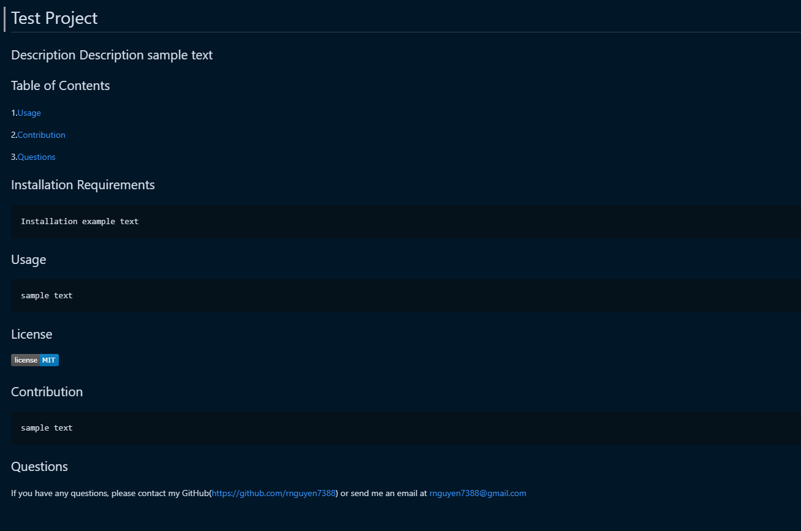
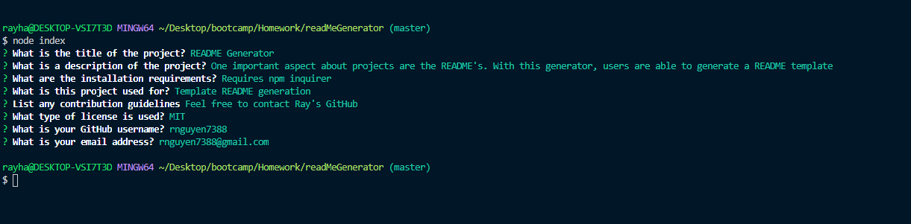

# README Generator
## Description
  This application will generate a template for README files
## Table of Contents
1.[Usage](#Usage)

2.[Contribution](#Contribution)
  
3.[Questions](#Questions)

This is sample generated template

Users will be asked questions to fill out template

## Installation Requirements
    Running npm inquirer
## Usage
    Users who need to write README's efficiently. 
## License

## Contribution
    Feel free to contact Ray's GitHub
## Video Demo Link
   https://youfiles.herokuapp.com/videodictionary/?m=Video_Player_Drive&state=%7B%22ids%22:%5B%221MmCw2xE45hCnBC0tOFSGsAikof-ielIt%22%5D,%22action%22:%22open%22,%22userId%22:%22112395634222205835182%22%7D
## Questions
If you have any questions, please contact my GitHub(https://github.com/rnguyen7388) or send me an email at rnguyen7388@gmail.com
